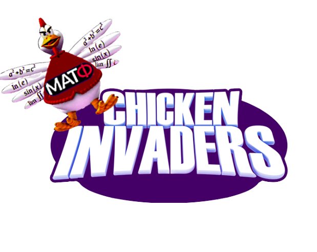

#  MATF Chicken Invaders

Zle kokoske osvajaci i njihovi saradnici napadaju galaksiju Mlecni put. Cilj ove igre jeste da ih porazimo i tako oslobodimo nasu galaksiju. 
To mozemo izvesti jedino tako sto cemo krenuti od Plutona, a zatim oslobadjati jednu po jednu planetu sve do Sunca. 
Ovaj poduhvat nije nimalo lak jer pored poznatih neprijatelja u svemiru postoje i jos neke neocekivane pretnje. 
Nadamo se da ste spremni za uzbudljivu avanturu!

# Programski jezik
[](https://www.cplusplus.com/) <br>
[](https://doc.qt.io/qt-5/) <br>

# Okruzenje
[](https://www.qt.io/product/development-tools)

# Preuzimanje i pokretanje igrice

1. U terminalu se pozicionirati u zeljeni direktorijum, a zatim ukucati komandu:
```shell
$ git clone https://gitlab.com/matf-bg-ac-rs/course-rs/projects-2020-2021/15-matf-chicken-invaders.git
```
2. Otvoriti okruzenje **Qt Creator** i u njemu otvoriti `15-matf-chicken-invaders/MATF_Chicken_Invaders/MATF_Chicken_Invaders.pro`.
3. Zatim pritisnuti dugme **Run** u donjem levom uglu ekrana i igra moze da pocne.

*Napomena: Ukoliko nemate Qt Creator mozete ga preuzeti [ovde](https://www.qt.io/product/development-tools).

# Uputstvo za koriscenje

U glavnom meniju postoje 4 dugmeta:
- Klikom na dugme **Hall Of Fame** mozemo videti tabelu najboljih rezultata igraca koji su igrali ovu igricu.
- Klikom na dugme **Options** mozete podesiti Easy ili Hard mod igre i, po potrebi, smanjiti  ili pojacati zvucne efekte.
- Klik na dugme **Quit** je jedini ispravan nacin za izlazak iz igre.
- Klikom na dugme **Save The World** otvara se login prozor i tu imate 2 mogucnosti da se ulogujete:
    1. Unosenjem svog username-a u tekst polje i potvrdjivanjem klikom na dugme **Ok**. U ovom slucaju registrovali ste se kao ucesnik i Vasa dostignuca ce biti sacuvana, a mozda se Vas username cak nadje i u Hall of Fame prozoru.
    2. Klikom na dugme **Skip** omogucen vam je takozvani Guest login, na taj nacin ste ulogovani kao anoniman korisnik o kom ne znamo nista pa ne mozemo da sacuvamo podatke, ali to Vas ne ometa da spasite svet!

# Pravila igrice

Svaki igrac na pocetku ima tri zivota. To su zivoti koji vrede za sve nivoe, dakle, ako igrac izgubi jedan zivot u prvom i jos dva u drugom nivou igra za njega je zavrsena, a ukoliko je ulogovan njegov skor se u tom slucaju cuva u bazi podataka. Ukoliko isti korisnik
opet odluci da igra on to moze uraditi i nivoi koje je on otkljucao se cuvaju, medjutim skor mu ponovo krece od 0 tako da ce morati da se pomuci kako bi njegovo ime dospelo na visoku poziciju u Hall of Fame. Igrac klikom na dugme <kbd>esc</kbd> moze da pauzira igru u bilo kom momentu, u tom slucaju ima dve opcije, jedna je da nastavi igru, a druga je da se vrati u pocetni meni. Igrica moze da se predje ako se predju svih 9 nivoa, ali to ne sprecava igraca koji ih je presao da opet igra i bira koji ce nivo kako bi bolje spremio za eventualni sledeci napad zlih osvajaca. Bitno je reci da izborom moda igre hard osvajaci postaju duplo jaci i samim tim opasniji.
Zivote mozete izgubiti tako sto vas pogodi jaje, kokoska, meteor ili projektil koji ispaljuje veliko jaje. Ukoliko skupite batak ili peceno pile vas skor se uvecava, a ukoliko skupite paketic broj projektila koje ispaljujete se uvecava, ali ide najvise od 5.

# Komande

<kbd>space</kbd>    Ispaljivanje projektila.<br>
<kbd>A</kbd> / <kbd>a</kbd>    Kretanje ulevo.<br>
<kbd>D</kbd> / <kbd>d</kbd>    Kretanje udesno.<br>

# Demo

*Napomena: Zvuk i slika su potpuno tecni tokom same igre dok u demo snimku ima blagih lagova. Razlog je verovatno los alat za snimanje ekrana.<br>
[Video](https://youtu.be/zzROa-nYsZY)

# Baza podataka

Imamo bazu podataka u kojoj se cuvaju podaci o svakom igracu koji se uloguje i to u formatu:
- **name**: varchar(50)
- **score**: integer
- **level**: integer
- **difficulty**: integer <br>
- primary key **name**

## Developers

- [Marko Babic, 77/2017](https://gitlab.com/markobabic8)
- [Maja Crnomarkovic, 21/2017](https://gitlab.com/crnomarkovicm)
- [Aleksandar Milosevic, 60/2017](https://gitlab.com/duhizjame)
- [Aleksandar Lisov, 236/2017](https://gitlab.com/AleksandarLisov)
